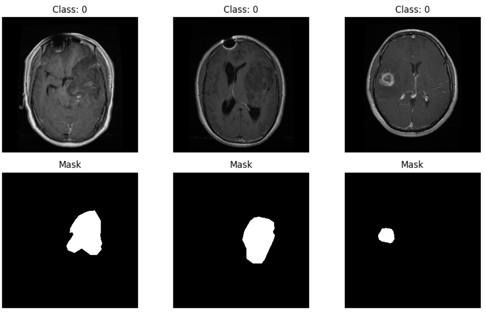
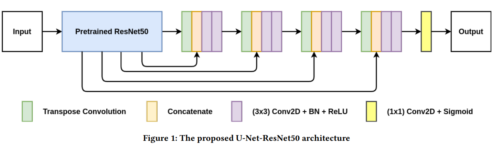
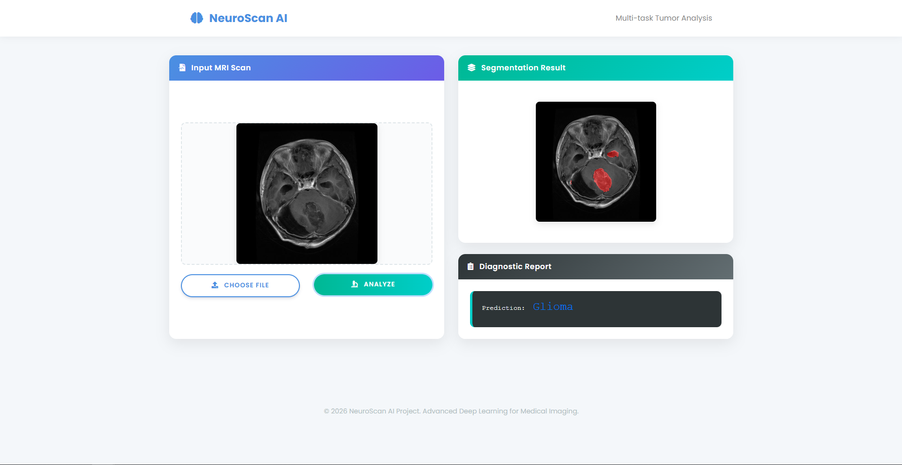

# Project: Multi-task Brain Tumor Classification and Segmentation

## 1. Introduction



The "Multi-task Brain Tumor Classification and Segmentation" project focuses on building an advanced Deep Learning model to improve the diagnosis of brain tumors from Magnetic Resonance Imaging (MRI).

The core of this project is the application of **Multi-task Learning**, which enables a single model to simultaneously perform two critical tasks:

+ **Classification:** Identifying the type of tumor (e.g., Glioma, Meningioma, Pituitary).
+ **Segmentation:** Automatically outlining the precise location, shape, and boundaries of the tumor on the MRI scan.

By forcing the model to learn both *what* the tumor is and *where* it is at the same time, we aim to create a smarter, more efficient, and more accurate diagnostic support tool.

## 2. Dataset Introduction (BRISC 2025)

### General Information

+ **Overview:** 6,000 brain MRI scans.
+ **Image Type:** T1-weighted contrast-enhanced (T1-CE MRI).
+ **Planes:** Axial, sagittal, and coronal.
+ **Origin:** Aggregated from public sources (Figshare, Br35H) and annotated by radiologists.

### Label Characteristics

+ **Classification:** 4 classes (Glioma, Meningioma, Pituitary, No Tumor).
+ **Segmentation:** Binary mask (Tumor region = 1, Background = 0).

## 3. Model Architecture

**Backbone:** ResNet50 (Encoder) + U-Net (Decoder) structure for segmentation with a classification head.


## 4. Project Workflow

1. Update `config.yaml`
2. Update `params.yaml`
3. Update Entity
4. Update Configuration Manager
5. Update Components
6. Update Pipeline
7. Update `main.py`
8. Update `dvc.yaml`
9. Update `app.py`

## 5. How to run (Local Development)

### Prerequisites

+ Anaconda or Miniconda
+ Git

### Steps

01. **Clone the repository**

    ```ruby
   git clone [https://github.com/QuangTruong2612/Project_1.git](https://github.com/QuangTruong2612/Project_1.git)
   cd Project_1
    ```

02. **Create ca conda environment**

    ```ruby
    conda create -n project-env python=3.10 -y
    conda activate project-env
    ```

03. **Install th requirements**

    ```ruby
    pip install -r requirements.txt
    ```

04.**Export  mlflow tracking**

    ```ruby
    export MLFLOW_TRACKING_URI=[https://dagshub.com/YourUser/YourRepo.mlflow](https://dagshub.com/YourUser/YourRepo.mlflow)
    export MLFLOW_TRACKING_USERNAME=YourUser
    export MLFLOW_TRACKING_PASSWORD=YourToken
    ```

05. **DVC cmd**

    ```ruby
    dvc init
    dvc repro
    dvc dag
    ```

06. **Run Web App**

    ```ruby
   python app.pys
   ```

## 6. Hybrid MLOps Architecture (CI/CD)

This project uses a Hybrid MLOps strategy to optimize costs and performance:

+ Training: Performed on a Local Machine (Self-hosted Runner) with GPU support (e.g., RTX 3060/4090) to avoid expensive Cloud GPU costs.
+ Model Registry: Trained models are automatically pushed to DagsHub (MLflow).
+ Deployment: The Web App is deployed on AWS EC2 (t3.small), which pulls the latest code from GitHub and the latest model from DagsHub.

Workflow Diagram:

  1. Push Code to GitHub main branch.
  2. GitHub Actions (Job 1) triggers the Local Runner.
  3. Local Runner trains the model using local GPU and pushes artifacts to DagsHub.
  4. GitHub Actions (Job 2) SSHs into AWS EC2.
  5. AWS EC2 pulls new code, rebuilds Docker, and starts the app (fetching the new model from DagsHub).

## 7. Setup Guide for MLOps

### Part 1: AWS EC2 Setup (Web Server)

  1. Launch Instance: Ubuntu 22.04, Instance Type t3.small.
  2. Security Group: Open ports 8080 (Custom TCP) and 22 (SSH).
  3. Install Docker & Git:

    ```ruby
    sudo apt-get update -y
    sudo apt-get install docker.io docker-compose git -y
    sudo usermod -aG docker $USER
    newgrp docker
    ```

  4. Clone Repo (First time only):
    ```ruby
    cd /home/ubuntu/
    git clone [https://github.com/QuangTruong2612/Project_1.git](https://github.com/QuangTruong2612/Project_1.git) project-1
    ```

### Part 2: Local Machine Setup (Training Worker)

  1. Go to GitHub Repo -> Settings -> Actions -> Runners -> New self-hosted runner.
  2. Select your OS (Windows/Linux) and follow the commands to install the runner.
  3. Important: When asked for tags, add the tag local-gpu.
  4. Start the runner.

### Part 3: GitHub Secrets Configuration

    Go to Settings -> Secrets and variables -> Actions and add:
        Secret Name, Value
        AWS_HOST, Public IP of your EC2 instance
        AWS_USER, ubuntu
        AWS_WEB_KEY, Content of your .pem key file
        MLFLOW_TRACKING_URI, Your DagsHub MLflow URI
        MLFLOW_TRACKING_USERNAME, Your DagsHub Username
        MLFLOW_TRACKING_REPO, Your DagsHub Repo


## Demo


