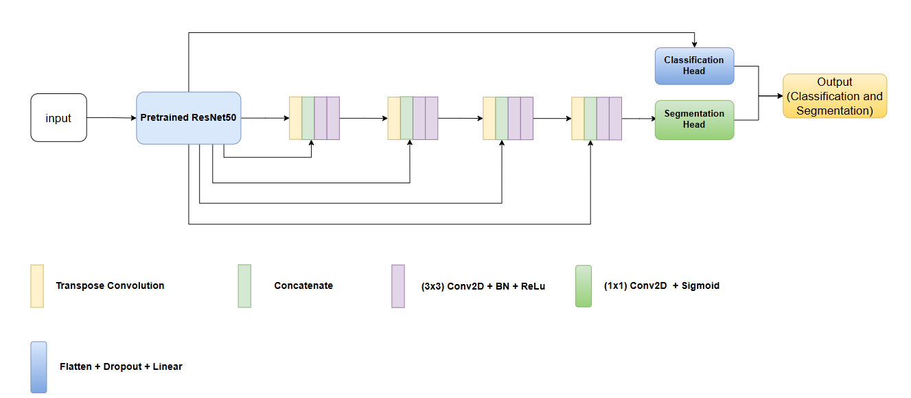

# 🧠 Multi-task Brain Tumor Classification and Segmentation

<div align="center">


**An advanced Deep Learning solution combining ResNet50 and U-Net to simultaneously detect tumor type and precise location from MRI scans.**

[View Demo](#-demo) • [Model Architecture](#-model-architecture) • [MLOps Workflow](#-hybrid-mlops-architecture-cicd) • [How to Run](#-how-to-run-local-development)

</div>

---

## 📖 1. Introduction

The **"Multi-task Brain Tumor Classification and Segmentation"** project focuses on building an advanced Deep Learning model to improve the diagnosis of brain tumors from Magnetic Resonance Imaging (MRI).

The core innovation lies in the application of **Multi-task Learning (MTL)**, enabling a single model to perform two critical tasks simultaneously:

* 🎯 **Classification:** Identifying the type of tumor (e.g., Glioma, Meningioma, Pituitary).
* 🧩 **Segmentation:** Automatically outlining the precise location, shape, and boundaries of the tumor on the MRI scan.

By forcing the model to learn both *what* the tumor is and *where* it is at the same time, we aim to create a smarter, more efficient, and more accurate diagnostic support tool.

## 📊 2. Dataset Introduction (BRISC 2025)

The model is trained on the **BRISC 2025** dataset, aggregated from public sources (Figshare, Br35H) and annotated by experts.

| Feature | Details |
| :--- | :--- |
| **Total Images** | 6,000 Brain MRI Scans |
| **Image Type** | T1-weighted contrast-enhanced (T1-CE MRI) |
| **Planes** | Axial, sagittal, and coronal |
| **Classification Labels** | 4 Classes: `Glioma`, `Meningioma`, `Pituitary`, `No Tumor` |
| **Segmentation Labels** | Binary Mask: `Tumor Region (1)`, `Background (0)` |

## 🏗 3. Model Architecture

We utilize a hybrid architecture designed for multi-task performance:
* **Backbone (Encoder):** **ResNet50** (Pre-trained) for robust feature extraction.
* **Decoder:** **U-Net** structure for precise segmentation mask generation.
* **Heads:** Classification Head and Segmentatio Head

<div align="center">
  
</div>

## 🔄 4. Project Workflow

The development lifecycle follows these structured steps:

1.  Update `config.yaml`
2.  Update `params.yaml`
3.  Update Entity
4.  Update Configuration Manager
5.  Update Components
6.  Update Pipeline
7.  Update `main.py`
8.  Update `dvc.yaml`
9.  Update `app.py`

## 💻 5. How to Run (Local Development)

### Prerequisites
* Anaconda or Miniconda
* Git

### Step-by-Step Installation

**1. Clone the repository**
```bash
git clone https://github.com/QuangTruong2612/Project_1.git
cd Project_1
```

**2. Create a Conda environment**
```bash
conda create -n project-env python=3.10 -y
conda activate project-env
```

**3. Install requirements**
```bash
pip install -r requirements.txt
```

**4. Export MLflow Tracking Credentials**
*Replace the values below with your DagsHub credentials.*
```bash
# Linux / Git Bash
export MLFLOW_TRACKING_URI=https://dagshub.com/YourUser/YourRepo.mlflow
export MLFLOW_TRACKING_USERNAME=YourUser
export MLFLOW_TRACKING_PASSWORD=YourToken

# Windows PowerShell
$env:MLFLOW_TRACKING_URI="https://dagshub.com/YourUser/YourRepo.mlflow"
$env:MLFLOW_TRACKING_USERNAME="YourUser"
$env:MLFLOW_TRACKING_PASSWORD="YourToken"
```

**5. Run DVC Pipeline**
```bash
dvc init
dvc repro   # Reproduce the pipeline
dvc dag     # Visualize the DAG
```

**6. Run the Web App**
```bash
python app.py
```

## 🚀 6. Hybrid MLOps Architecture (CI/CD)

This project uses a **Hybrid MLOps strategy** to optimize costs and performance:

* **Training:** Performed on a **Local Machine (Self-hosted Runner)** with GPU support (e.g., RTX 3060/4090) to avoid expensive Cloud GPU costs.
* **Model Registry:** Trained models are automatically pushed to **DagsHub (MLflow)**.
* **Deployment:** The Web App is deployed on **AWS EC2 (t3.small)**, which pulls the latest code from GitHub and the latest model from DagsHub.

### Workflow Diagram

1.  Push Code to GitHub `main` branch.
2.  **GitHub Actions (Job 1):** Triggers the Local Runner.
3.  **Local Runner:** Trains the model using local GPU and pushes artifacts to DagsHub.
4.  **GitHub Actions (Job 2):** SSHs into AWS EC2.
5.  **AWS EC2:** Pulls new code, rebuilds Docker, and starts the app (fetching the new model from DagsHub).

## ⚙️ 7. Setup Guide for MLOps

### Part 1: AWS EC2 Setup (Web Server)

1.  **Launch Instance:** Ubuntu 22.04, Instance Type `t3.small`.
2.  **Security Group:** Open ports `8080` (Custom TCP) and `22` (SSH).
3.  **Install Docker & Git:**
    ```bash
    sudo apt-get update -y
    sudo apt-get install docker.io docker-compose git -y
    sudo usermod -aG docker $USER
    newgrp docker
    ```
4.  **Clone Repo (First time only):**
    ```bash
    cd /home/ubuntu/
    git clone https://github.com/QuangTruong2612/Project_1.git project-1
    ```

### Part 2: Local Machine Setup (Training Worker)

1.  Go to GitHub Repo -> **Settings** -> **Actions** -> **Runners** -> **New self-hosted runner**.
2.  Select your OS (Windows/Linux) and follow the commands to install the runner.
3.  **Important:** When asked for tags, add the tag `local-gpu`.
4.  Start the runner.

### Part 3: GitHub Secrets Configuration

Go to **Settings** -> **Secrets and variables** -> **Actions** and add the following:

| Secret Name | Value Description |
| :--- | :--- |
| `AWS_HOST` | Public IP of your EC2 instance |
| `AWS_USER` | `ubuntu` |
| `AWS_WEB_KEY` | Content of your `.pem` private key file |
| `MLFLOW_TRACKING_URI` | Your DagsHub MLflow URI |
| `MLFLOW_TRACKING_USERNAME` | Your DagsHub Username |
| `MLFLOW_TRACKING_REPO` | Your DagsHub Repo Name |

## 📷 Demo

<div align="center">
  
</div>

---
<div align="center">
  Created by QuangTruong2612 | 2025
</div>